  

### ❯ whoami

Student and systems tinkerer. I take bare Linux boxes and make them fast, hardened
and observable — kernel tuning, nftables, containers, tunnels — then turn the scars
into scripts and runbooks. Most of it is pair-built with **Claude Code**, hence
*“doctore claude”*.

- 🌐 [**jestivald.tech**](https://jestivald.tech) — terminal-flavored homepage
- 💬 [**@jestivald**](https://t.me/jestivald) — Telegram

### ❯ ls ~/projects

| repo | what it does |
|------|--------------|
| [**node-accelerator**](https://github.com/jestivald/node-accelerator) ⭐ | Bash toolkit that tunes and shields a Linux server — XanMod + BBRv3, sysctl, nftables anti-flood, CrowdSec, `na-report` forensics |
| [**server-bench**](https://github.com/jestivald/server-bench) | All-in-one server diagnostics & benchmark — CPU/disk/net, scorecard verdicts, `--json` output |

### ❯ cat stack.txt

  
  
  
  
  
  
  
  
  
  

### ❯ na-report --github

metrics refresh daily at 03:00 — powered by <a href="https://github.com/lowlighter/metrics">lowlighter/metrics</a>
